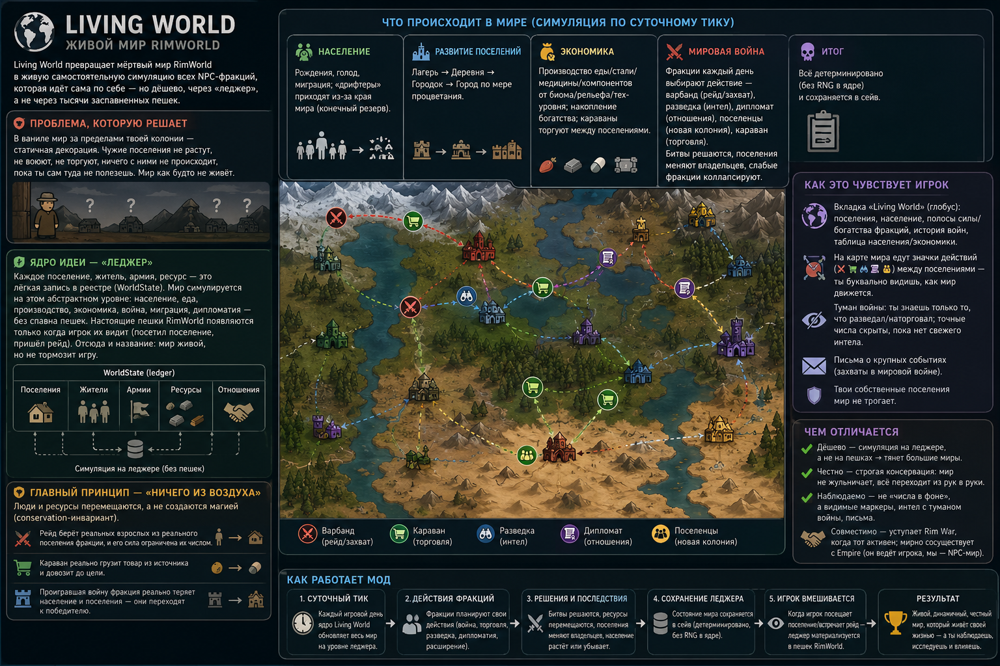

# Living World

> **Nothing appears from nowhere.**

**Living World turns RimWorld's dead world map into a living, self-running simulation of every NPC faction — cheaply.** Settlements grow, trade, develop, wage war and fall on their own while you are busy with your colony. The whole world runs on a lightweight **ledger** instead of thousands of spawned pawns, so the planet stays alive without tanking performance.

## The essence

In vanilla RimWorld, the world beyond your colony is a static backdrop — factions and their settlements do nothing until you interact. Living World replaces that with a persistent simulation where **every settlement, citizen, army, resource and caravan is a real record in a world ledger** (`WorldState`), simulated abstractly and materialized into actual RimWorld pawns **only when you can see them**.

Its founding rule is conservation — **nothing from thin air**: people and goods move and transfer, they are never magically created. A raid draws real adults from a real faction settlement (and is only as strong as that settlement can afford); a caravan physically loads and delivers goods; a faction that loses a war actually loses population and settlements to the victor.

## What lives in the world (daily, deterministic, saved)

- **Population** — births, starvation, migration, and outsiders ("drifters") arriving from beyond the map out of a finite reserve.
- **Settlement growth** — Camp → Village → Town → City as a settlement prospers.
- **Economy** — production of food/steel/medicine/components from biome, terrain and tech; accumulating wealth; **caravans trading** goods between settlements.
- **World war** — each faction picks a daily action: **warband** (raid & capture), **scout** (gather intel), **diplomat** (improve relations), **settler** (found a colony), **caravan** (trade). Battles resolve, settlements change hands, weak factions collapse.

## How you experience it

- A **Living World tab** (globe button): settlements, populations, faction strength & wealth bands, war history, and a population/economy table.
- **Markers travel the world map** — warbands, caravans, scouts and diplomats move between settlements in faction colours, so you watch the world move.
- **Fog of war** — you only know what you have scouted or traded for; exact numbers stay hidden until your intel is fresh.
- **Letters** announce major world events (war captures).
- Enemy raids against **you** pull real people from a real faction settlement — never spawned from nothing.
- Your own settlements are never swept into the simulation.

## Compatibility

- **Rim War** — Living World stands its world war down while Rim War is driving factions (no double-driving).
- **Empire** — coexists: Empire manages your own empire; Living World tracks the NPC world.
- Requires **Harmony**.

---

## Status

Living World is a working simulation, not a stub. The ledger, population flow, settlement development, economy and trade, and the world war (warbands, caravans, scouts, diplomats) all run on the daily tick, persist through save/load, and are covered by 200+ automated tests. Active work is on-map visualization and depth — see the roadmap.

## Design & docs

This README is deliberately a short intro. The deep material lives in:

- [`docs/roadmap.md`](docs/roadmap.md) — project stages and priorities.
- [`docs/research/livingworld-foundation.md`](docs/research/livingworld-foundation.md) — architecture and integration rules.
- [`docs/design/`](docs/design/) — per-system designs (world-war absorption, population flow, economy, gaps).
- [`docs/vision.md`](docs/vision.md) — the original vision, design principles, planned systems and research notes.

## Original implementation

Living World is written from scratch. Other RimWorld mods are studied only as research references — no code, assets, XML, textures or balancing tables are copied. General ideas and architectural lessons are fair game; everything shipped (including the icons) is original work.

## License & disclaimer

Code is MIT; generated art/assets are project-owned and not for reuse without permission. Living World is an independent project — RimWorld is by Ludeon Studios, and the mods referenced for research belong to their authors.
